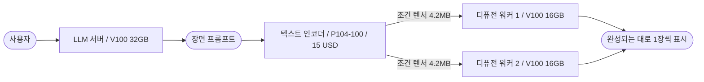

[English](README.md) / **한국어**

# local-ai-cost-cutting

**로컬 AI 서버 구축 비용을 낮추는 세 가지 기법**

아키텍처와 VRAM 크기가 서로 다른 중고 GPU를 섞어 **LLM 챗봇 + 이미지 생성 서버**를 만든 기록이다. 같은 산출량을 **3분의 1 비용**으로 얻거나, 더 싼 비용으로 **두 배 산출량**을 얻었다.

모든 수치는 실측이며 [원시 데이터](docs/ko/98-benchmark.md)와 재현 스크립트를 함께 공개한다.

---

## 왜 이 프로젝트가 있는가

로컬에서 돌아가는 **롤플레잉 챗봇**을 만들려 했다. 대화하는 LLM과, 그 대화 내용에 맞는 인물/장면 이미지를 생성하는 파이프라인을 **한 서버에서 동시에** 굴려야 했다.

상용 API로는 세 가지가 걸렸다. 지속적인 대화량에 비례하는 **요금**(정액제에서는 토큰 사용량 부족), 창작물 생성에 걸리는 **내용 제약**, 그리고 **특정 유형의 코드 분석이 거부되는 것**이다. 로컬 구축이 유일한 선택지였다.

그런데 필요한 VRAM을 최신 카드로 채우려니 견적이 **1만 달러를 넘었다.**

```
LLM 27B Q6          약 30GB   ---+
이미지 모델 Q8      약 19GB   ---+--  최신 카드로 채우면 A100 80GB 1장 = 11,000 USD (1)
```

카드를 장착하기 위한 플랫폼 구축비까지 포함하면 **약 12,000 USD**. 승인 불가능한 규모였고, 전체 시스템 비용을 낮출 필요가 있었다.

**그리고 그 돈을 쓴다고 성능이 그만큼 오르지도 않는다.** 이미지 생성은 연산이 전체 시간의 90%를 차지하는데([계산](docs/ko/00-method.md#2-병목-판정은-계산으로-확인할-수-있다)), A100의 연산 성능은 V100의 **2.5배**(312 대 125 TFLOPS)에 그친다. 모델 로드/인코딩 같은 고정 구간까지 넣으면 실질 격차는 더 줄어든다. **고정 구간 포함 2.4배 성능 격차에 가격은 15.7배다.** 구체적인 추정치는 아래 결과 표에 함께 실었다.

이 프로젝트는 그 격차를 메운 방법에 대한 기록이다. 최종 구성은 GPU 4장(GPU 비용 1,115 USD)에 CPU/RAM/전원/케이스를 포함한 시스템 전체를 합쳐 **약 2,000 USD**로 완결되었다. (2)

> **(1)** 이 가격은 SXM4 타입의 A100 80GB를 PCIe 버전으로 개조한 GPU 기준이다. 공식 리테일 A100 80GB PCIe 버전은 **20,000 USD 이상**이었다.
>
> **(2)** 이 비용에 본인 인건비는 계상하지 않았다. 외주업체에 유사 견적을 5분간 상담한 결과, 모든 하드웨어를 제공한다는 전제 하에 **800 USD 이상**이 들 것이라는 구두 회신을 받았다. 상세 명세가 아닌 전체 프로젝트 규모에 대한 개략적 견적임에 주의.

---

## 결과

기준은 FLUX D 모델을 **V100 32GB 한 장(700 USD)에 통째로 올린 구성**이다. 768x768 / 15스텝 / 얼굴 일관성 확장 활성 / 512토큰 프롬프트에서 8장 생성에 261.7초가 걸렸다.

| 구분 | 구성 | 비용 | 8장 생성 | 장당 | 비고 |
|---|---|---|---|---|---|
| *추정* | A100 80GB x1 | *11,000 USD* | *약 110초* (3) | *13.8초* | 15.7배 비싸고 2.4배 빠름 |
| **기준** | V100 32GB x1 | 700 USD | 261.7초 | 32.7초 | 통째로 마운트 |
| **A** | V100 16GB x1 + P104-100 | **215 USD** | 240.7초 | 30.1초 | 동등한 산출량 (4), **비용 69% 절감** |
| **B** | V100 16GB x2 + P104-100 | **415 USD** | **134.0초** | 16.8초 | **41% 싸고 1.95배** |
| *C* | V100 16GB x3 + P104-100 | *615 USD* | *105~107초* (3) | *13.2초* | **A100 추정치와 사실상 동일** |

**C가 이 프로젝트의 결론이다.** 615 USD 구성이 11,000 USD 구성과 거의 같은 산출량을 낸다 - **가격 차이 17.9배.**

그리고 사용자가 **첫 이미지를 보기까지의 대기가 261.5초에서 48.1초로** 줄었다. 같은 자원에서 표시 방식만 바꾼 통제 실험으로는 **261.5초에서 46.7초, 5.6배**다 -> [No.3 조기 표시](docs/ko/03-pipeline-throughput.md#4-실측)

> **(3) 추정치이며 실측이 아니다.**
> **A100** - 이 프로젝트의 V100 실측에 연산 성능비 2.5배를 생성 구간에만 적용해 산출했다. 디퓨전은 연산이 90%이므로 이 근사가 성립한다. **A100 쪽에 유리하게 잡은 값이다** - bf16 모델은 Q8의 두 배 크기라 로드가 더 걸리는데 반영하지 않았다. 공개된 A100 실측치를 쓰지 않은 이유는 [부록 11-1](docs/ko/98-benchmark.md#11-1-상위-카드-비교를-넣지-않은-이유)에 있다.
> **C** - 조건 3/4에서 워커 확장 계수를 역산했다. 워커가 3개면 기동 시 디스크 경합과 카드 간 발열이 커지므로 **낙관적 상한이다** -> [부록 4-2](docs/ko/98-benchmark.md#4-2-조건-5-산출)
>
> **(4)** 실측에서는 A가 기준보다 21초 빨랐다. 이 차이는 모듈 분리의 효과가 아니라 **기준 구성에 쓴 32GB 카드의 발열 스로틀**에서 비롯된 것이라 이득으로 계상하지 않았다. 원인을 어떻게 가려냈는지는 [부록 9장](docs/ko/98-benchmark.md#9-반증---32gb-카드가-느렸던-이유)에 있다.

전체 측정 조건, 원시 CSV 36행, 파생 계산, 반증 과정은 [부록 - 벤치마크](docs/ko/98-benchmark.md)에 있다.

---

## 세 갈래의 기법

이 프로젝트에서 결과물이 출력되는 흐름은 아래와 같다.



이 프로젝트는 실질적으로 **세 개의 독립적인 기법**이 적용되어 완성되었다. 서로 연결되어 있지만 **독립적으로도 성립한다.**

| | 기법 | 핵심 | 단독으로 성립하는가 |
|---|---|---|---|
| **No.1** | [이종 GPU 역할 배정](docs/ko/01-role-assignment.md) | 각 작업에 **필요한 만큼만** 자원을 배정한다 | O 이미지 생성과 무관하게 적용 |
| **No.2** | [인코더 분리](docs/ko/02-encoder-separation.md) | 모델을 쪼개 **요구 VRAM 하한**을 낮춘다 | O **동일 GPU 2장 환경에서도 성립** |
| **No.3** | [조기 표시](docs/ko/03-pipeline-throughput.md) | 결과를 1장씩 내보내 **사람의 유휴 시간을 줄인다** | O **GPU 구성과 완전히 무관** |

세 기법의 관계는 이렇다.

**No.2가 No.1을 가능하게 한다.** 이미지 모델을 통째로 올리면 19.1GB라 200 USD짜리 16GB 카드는 애초에 후보가 아니다. 인코더를 떼어내 워커가 13.6GB가 된 뒤에야 그 카드가 선택지가 된다. **카드를 고르는 문제로 보이지만 실제로는 작업을 나누는 문제였다.**

**No.2가 No.3을 가능하게 한다.** N장을 배치로 묶는 이유는 보통 프롬프트 인코딩을 1회로 줄이기 위해서다. 인코딩 결과를 워커들이 공유하게 만들면 그 제약이 사라지고, **1장 = 1작업**으로 비용 추가 없이 쪼갤 수 있다.

---

## 실제 구성

```
CPU      AMD EPYC 7232P                  PCIe 128레인
보드     ASRock Rack EPYCD8-2T
OS       Ubuntu 24.04 / CUDA 12.8        <- 버전 고정이 운영 원칙
```

| GPU | 역할 | VRAM 사용 | 가격 |
|---|---|---|---|
| Tesla V100-SXM2 32GB | LLM 서버 | 30.3GB | 700 USD |
| Tesla V100-SXM2 16GB x2 | 디퓨전 워커 | 각 13.6GB | 400 USD |
| **NVIDIA P104-100 8GB** | **텍스트 인코더** | 5.2GB | **15 USD** |
| | | **합계** | **1,115 USD** |

**15 USD짜리 채굴용 카드가 비용 절감에 큰 기여를 한다.** 이 카드는 VRAM이 8GB뿐이고 f16 연산은 V100의 15분의 1 수준이라 디퓨전에도 LLM에도 쓸 수 없지만, **q8_0 경로에서는 격차가 5.6배로 좁혀진다.** **디퓨전 모델을 모듈 단위로 분해하고 적절한 모듈을 q8_0으로 양자화해, 8GB에 들어가면서 그 카드가 잘하는 연산이 되게 바꿔 준 것**이 핵심이다 -> [No.1 4장](docs/ko/01-role-assignment.md#4-카드의-연산-유닛을-먼저-파악한다)

---

## 이 방법이 맞지 않는 경우

- **예산 제약이 없다면** 복잡성만 늘어난다. 진짜 대가는 전기요금이 아니라 **관리 복잡도와 소프트웨어 수명**이다. 구세대 카드를 쓰는 순간 스택 전체가 특정 CUDA 버전에 묶인다
- **모델이 한 카드에 안 들어가 텐서 병렬이 필요하면** 전제가 완전히 달라진다. 이종 카드 간 텐서 병렬은 느린 카드에 맞춰지고 NVLink급 인터커넥트가 필요하다
- **추론 엔진을 개조할 수 없거나 하고 싶지 않으면** No.2는 불가능하다
- **하드웨어 트러블슈팅 역량이 없다면** 부팅조차 안 되는 상황에서 원인 파악부터 막힌다. 냉정하게 판단해서, 본인에게 이 역량이 없다면 **전문 업체 외주가 결과적으로 더 효율적일 수 있다**

그리고 반대 방향의 조언 하나 - **저가 카드를 파이프라인 어딘가에 기여시킬 방법은 대개 존재한다.** 포기하기 전에 비슷한 카드를 쓴 사례를 먼저 찾아보기를 권한다.

---

## 어디부터 읽을 것인가

| 관심사 | 시작점 |
|---|---|
| **비용 절감 결과가 궁금하다** | [위 결과 표](#결과) |
| **GPU를 사기 전에 뭘 계산해야 하나** | [공통 방법론](docs/ko/00-method.md) |
| **각 작업에 어떤 카드를 붙일지 정하고 싶다** | [No.1 역할 배정](docs/ko/01-role-assignment.md) |
| **추론 엔진을 개조해 모델을 쪼개고 싶다** | [No.2 인코더 분리](docs/ko/02-encoder-separation.md) |
| **GPU와 무관하게 처리량을 올리고 싶다** | [No.3 조기 표시](docs/ko/03-pipeline-throughput.md) |
| **여러 GPU에 서비스를 배치해 운영해야 한다** | [No.4 오케스트레이션](docs/ko/04-orchestration.md) |
| **수치를 직접 검증하고 싶다** | [부록 - 벤치마크](docs/ko/98-benchmark.md) |
| **같은 시행착오를 피하고 싶다** | [함정 모음](docs/ko/99-pitfalls.md) |
| **똑같이 한 대 만들어 보고 싶다** | [부록 - 구축 기록](docs/ko/appendix/build-log.md) |
| **어떤 순서로 진행할지 모르겠다** | [부록 - 설계 기록](docs/ko/appendix/design-record.md) |

---

## 재현에 필요한 자료

| 디렉터리 | 내용 |
|---|---|
| [`patches/`](patches/) | stable-diffusion.cpp 개조 3종. **전부 `--revert` 지원** |
| [`reference/`](reference/) | 오케스트레이션 참조 구현 (인코더 1벌 + 워커 N벌) |
| [`bench/`](bench/) | 벤치마크 스크립트. GPU UUID와 모델 경로만 바꾸면 된다 |

측정을 재현하려면 [부록 13장](docs/ko/98-benchmark.md#13-재현-방법)을 따른다.

**패치는 특정 커밋(`f440ad9c`) 기준의 문자열 앵커 방식이다.** 상류가 바뀌었으면 앵커를 못 찾고 중단한다 - 파일을 망가뜨리지는 않는다. 적용 순서와 검증 방법은 [`patches/README.md`](patches/README.md) 에 있다.

**오케스트레이터 쪽은 패치가 아니라 참조 구현이다.** 서비스를 띄우고 작업을 분배하는 코드는 프로젝트마다 구조가 달라 diff 로 배포할 수 없다. 패턴만 남기고 프로젝트 고유 부분을 걷어낸 [`reference/orchestrator.py`](reference/orchestrator.py) 를 옮겨 심는 용도로 쓴다.

---

## 의존 프로젝트

이 저장소는 아래 프로젝트들 위에 만들어졌다. **원저작자의 작업이 없었다면 성립하지 않는다.**

| 프로젝트 | 용도 |
|---|---|
| [stable-diffusion.cpp](https://github.com/leejet/stable-diffusion.cpp) | 이미지 생성 추론 엔진. `patches/` 의 개조 대상 |
| [llama.cpp](https://github.com/ggml-org/llama.cpp) | LLM 추론 엔진 |
| [PuLID](https://github.com/ToTheBeginning/PuLID) | 얼굴 일관성 유지 (ByteDance) |
| [InsightFace](https://github.com/deepinsight/insightface) | 얼굴 임베딩 추출 |

### 라이선스 주의 - 상업적 이용 전 반드시 확인할 것

**추론 엔진은 대체로 허용적이지만(MIT 등), 모델 가중치는 그렇지 않은 경우가 많다.**

- **FLUX.1 [dev] 계열 가중치** - 비상업 라이선스다. 파생 모델/양자화본도 원본 라이선스를 승계한다
- **InsightFace 사전학습 모델** - 비상업 연구 용도로 배포된다
- **파인튜닝/병합 모델** - 배포처마다 조건이 다르다. 베이스 모델의 제약이 그대로 따라온다

**이 저장소는 코드와 문서만 배포하며 모델 가중치는 포함하지 않는다.** 각 모델의 라이선스는 배포처에서 직접 확인해야 하며, 위 요약은 참고용일 뿐 법적 조언이 아니다.

---

## 라이선스

| 대상 | 라이선스 |
|---|---|
| `docs/` 의 문서 | [CC BY 4.0](LICENSE-docs) |
| `patches/` / `reference/` / `bench/` 의 코드 | [MIT](LICENSE) |

---

## 관련 고지

**이 문서에서 cost는 경제학의 용법 그대로 "자원의 소비"를 뜻한다.** 구입 가격만이 아니라 전력/공간/관리 복잡도/소프트웨어 수명까지 포함한다. 위 표의 USD는 그중 **초기 구입 비용만** 떼어 본 것이고, 나머지 항목이 어떻게 늘어나는지는 [No.1 7장](docs/ko/01-role-assignment.md#7-비용-구조와-하드웨어-제약)에서 따로 다룬다. **줄어든 것만 세면 계산이 틀린다.**

출처가 언급되지 않은 모든 수치는 위에 적은 단일 서버에서 측정했다. **다른 장비에서는 달라진다.** 특히 이 서버의 32GB 카드는 섀시 내 위치 때문에 지속 부하에서 발열 제약을 받았으며, 그 사실이 일부 수치에 영향을 준다 - 어떻게 발견했고 어떻게 처리했는지는 [부록 9장](docs/ko/98-benchmark.md#9-반증---32gb-카드가-느렸던-이유)에 그대로 적어 두었다.

**이 문서의 모든 가격은 2026년 8월 대한민국 기준이며, GPU는 중고 시세다.** 지역과 시점에 따라 크게 달라지므로, 본인 시장 가격을 넣고 [단위 성능당 가격](docs/ko/00-method.md#4-단위-성능당-가격)을 다시 계산해야 한다.

A100의 11,000 USD는 SXM4 개조판 기준으로, **비교에서 A100에 가장 유리하게 잡은 값이다.** 공식 리테일 PCIe 버전(20,000 USD 이상)을 기준으로 하면 가격 격차는 15.7배가 아니라 **28.6배**가 된다.
