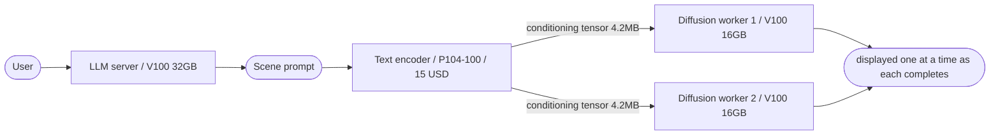

**English** / [한국어](README.ko.md)

# local-ai-cost-cutting

**Three techniques for cutting the cost of building a local AI server**

A record of building an **LLM chatbot + image generation server** by mixing used GPUs of different architectures and VRAM sizes. The result: the same throughput at **one third of the cost**, or **twice the throughput** for less money.

Every figure is measured. The [raw data](docs/en/98-benchmark.md) and the reproduction scripts are published alongside.

> **On language.** This project was originally written in Korean. [The Korean documents](README.ko.md) are the original, and everything in English is a translation of them - where the two disagree, the Korean is authoritative. Corrections to unnatural phrasing or mistranslated technical terms are welcome; please open an issue.

---

## Why This Project Exists

The goal was a **role-playing chatbot** running locally. A conversational LLM and a pipeline that generates character and scene images matching that conversation had to run **on the same server, at the same time**.

Three things ruled out commercial APIs: the **cost** that scales with sustained conversation volume (on flat-rate plans, running out of tokens), **content restrictions** on creative generation, and **certain categories of code analysis being refused**. Building locally was the only option.

But filling the required VRAM with current-generation cards put the quote **over ten thousand dollars**.

```
LLM 27B Q6           ~30GB   ---+
Image model Q8       ~19GB   ---+--  current-gen equivalent: A100 80GB x1 = 11,000 USD (1)
```

Including the platform needed to host the card, that is **about 12,000 USD**. Unapprovable, so the total system cost had to come down.

**And that money does not buy proportional performance.** Image generation spends 90% of its wall clock on compute ([calculation](docs/en/00-method.md#2-bottleneck-classification-can-be-settled-by-calculation)), and the A100's compute is only **2.5x** the V100's (312 vs 125 TFLOPS). Once fixed costs like model loading and encoding are included, the real gap narrows further. **A 2.4x performance gap including fixed costs, against a 15.7x price gap.** The concrete estimates are in the results table below.

This project is a record of how that gap was closed. The final configuration uses 4 GPUs (1,115 USD in GPUs) and, with CPU, RAM, power supply, and case included, came to **about 2,000 USD** for the whole system. (2)

> **(1)** This price is for an A100 80GB SXM4 module converted to PCIe. The official retail A100 80GB PCIe card was **over 20,000 USD**.
>
> **(2)** This cost excludes the builder's own labor. A five-minute consultation with a system integrator for a comparable job returned a verbal estimate of **over 800 USD**, assuming all hardware was supplied. Note that this was a rough figure for the project as a whole, not an itemized quote.

---

## Results

The baseline is the FLUX D model loaded whole onto **a single V100 32GB (700 USD)**. At 768x768 / 15 steps / face-consistency extension enabled / 512-token prompt, generating 8 images took 261.7 seconds.

| | Configuration | Cost | 8 images | Per image | Notes |
|---|---|---|---|---|---|
| *estimate* | A100 80GB x1 | *11,000 USD* | *~110s* (3) | *13.8s* | 15.7x the price, 2.4x the speed |
| **baseline** | V100 32GB x1 | 700 USD | 261.7s | 32.7s | loaded whole |
| **A** | V100 16GB x1 + P104-100 | **215 USD** | 240.7s | 30.1s | equivalent throughput (4), **69% cost reduction** |
| **B** | V100 16GB x2 + P104-100 | **415 USD** | **134.0s** | 16.8s | **41% cheaper, 1.95x faster** |
| *C* | V100 16GB x3 + P104-100 | *615 USD* | *105~107s* (3) | *13.2s* | **effectively equal to the A100 estimate** |

**C is this project's conclusion.** A 615 USD configuration delivers nearly the same throughput as an 11,000 USD one - a **17.9x price difference.**

And the wait before the user sees the **first image dropped from 261.5s to 48.1s**. In a controlled experiment that changed only the display method on identical hardware, it went **from 261.5s to 46.7s, a 5.6x improvement** -> [No.3 Incremental Display](docs/en/03-pipeline-throughput.md#4-measurements)

> **(3) These are estimates, not measurements.**
> **A100** - derived by applying the 2.5x compute ratio to the generation phase only of this project's V100 measurements. Diffusion is 90% compute, so the approximation holds. **The value is generous to the A100** - a bf16 model is twice the size of Q8 and would take longer to load, which is not accounted for. Why published A100 measurements were not used instead is explained in [Appendix 11-1](docs/en/98-benchmark.md#11-1-why-no-comparison-against-higher-tier-cards).
> **C** - the worker scaling factor was back-calculated from conditions 3 and 4. With three workers, disk contention at startup and inter-card heat both increase, so this is an **optimistic upper bound** -> [Appendix 4-2](docs/en/98-benchmark.md#4-2-deriving-condition-5)
>
> **(4)** In the measurements, A was 21 seconds faster than the baseline. That difference comes not from module separation but from **thermal throttling on the 32GB card used in the baseline**, so it is not counted as a gain. How the cause was isolated is in [Appendix 9](docs/en/98-benchmark.md#9-disconfirmation---why-the-32gb-card-was-slower).

Full measurement conditions, 36 rows of raw CSV, derived calculations, and the disconfirmation process are in [Appendix - Benchmarks](docs/en/98-benchmark.md).

---

## Three Techniques

Output flows through this project as follows.



This project is really **three independent techniques**. They connect to each other, but **each stands on its own.**

| | Technique | Core idea | Stands alone? |
|---|---|---|---|
| **No.1** | [Heterogeneous GPU Role Assignment](docs/en/01-role-assignment.md) | give each task **only as much as it needs** | O applies regardless of image generation |
| **No.2** | [Encoder Separation](docs/en/02-encoder-separation.md) | split the model to lower the **minimum VRAM requirement** | O **works even with two identical GPUs** |
| **No.3** | [Incremental Display](docs/en/03-pipeline-throughput.md) | emit results one at a time to **cut human idle time** | O **entirely independent of GPU configuration** |

The three relate to each other like this.

**No.2 is what makes No.1 possible.** Loaded whole, the image model needs 19.1GB, so a 200 USD 16GB card is not a candidate at all. Only after the encoder is split off and the worker drops to 13.6GB does that card become an option. **It looks like a card-selection problem, but it is really a task-partitioning problem.**

**No.2 is also what makes No.3 possible.** The usual reason to batch N images is to encode the prompt only once. Once the encoding result is shared across workers, that constraint disappears and the work can be split into **one image = one job** at no additional cost.

---

## Actual Configuration

```
CPU      AMD EPYC 7232P                  128 PCIe lanes
Board    ASRock Rack EPYCD8-2T
OS       Ubuntu 24.04 / CUDA 12.8        <- version pinning is an operating principle
```

| GPU | Role | VRAM used | Price |
|---|---|---|---|
| Tesla V100-SXM2 32GB | LLM server | 30.3GB | 700 USD |
| Tesla V100-SXM2 16GB x2 | Diffusion workers | 13.6GB each | 400 USD |
| **NVIDIA P104-100 8GB** | **Text encoder** | 5.2GB | **15 USD** |
| | | **Total** | **1,115 USD** |

**A 15 USD mining card contributes substantially to the cost reduction.** It has only 8GB of VRAM and its f16 throughput is about one fifteenth of a V100's, so it can serve neither diffusion nor the LLM - but **on the q8_0 path the gap narrows to 5.6x.** The key move was **decomposing the diffusion model into modules and quantizing the right module to q8_0, so that it both fits in 8GB and becomes the kind of work that card is good at** -> [No.1 Section 4](docs/en/01-role-assignment.md#4-identify-the-cards-compute-units-first)

---

## When This Approach Does Not Apply

- **If budget is not a constraint**, this only adds complexity. The real price is not the electricity bill but **management complexity and software lifespan**. The moment you use previous-generation cards, the entire stack is pinned to a specific CUDA version
- **If the model does not fit on one card and tensor parallelism is required**, the premises change completely. Tensor parallelism across heterogeneous cards runs at the speed of the slowest card and demands an NVLink-class interconnect
- **If you cannot or will not modify the inference engine**, No.2 is off the table
- **If you lack hardware troubleshooting skill**, you will stall at diagnosing a machine that will not even POST. Judge this honestly: if you do not have that skill, **hiring a system integrator may well be the more efficient outcome**

And one piece of advice in the opposite direction - **there is usually some place in the pipeline where a cheap card can contribute.** Before giving up, look for cases where someone has used a similar card.

---

## Where to Start

| Interest | Entry point |
|---|---|
| **What the cost savings actually were** | [the results table above](#results) |
| **What to calculate before buying a GPU** | [Common Methodology](docs/en/00-method.md) |
| **Deciding which card to attach to which task** | [No.1 Role Assignment](docs/en/01-role-assignment.md) |
| **Modifying an inference engine to split a model** | [No.2 Encoder Separation](docs/en/02-encoder-separation.md) |
| **Raising throughput independently of the GPUs** | [No.3 Incremental Display](docs/en/03-pipeline-throughput.md) |
| **Running services placed across several GPUs** | [No.4 Orchestration](docs/en/04-orchestration.md) |
| **Verifying the numbers yourself** | [Appendix - Benchmarks](docs/en/98-benchmark.md) |
| **Avoiding the same mistakes** | [Pitfalls](docs/en/99-pitfalls.md) |
| **Building the same machine** | [Appendix - Build Log](docs/en/appendix/build-log.md) |
| **Working out what order to do things in** | [Appendix - Design Record](docs/en/appendix/design-record.md) |

---

## Materials for Reproduction

| Directory | Contents |
|---|---|
| [`patches/`](patches/) | three modifications to stable-diffusion.cpp. **All support `--revert`** |
| [`reference/`](reference/) | orchestration reference implementation (one encoder + N workers) |
| [`bench/`](bench/) | benchmark scripts. Only the GPU UUIDs and model paths need changing |

To reproduce the measurements, follow [Appendix 13](docs/en/98-benchmark.md#13-reproduction).

**The patches use string anchors against a specific commit (`f440ad9c`).** If upstream has changed, they fail to find the anchor and stop - they do not corrupt the file. Application order and verification are in [`patches/README.md`](patches/README.md).

**The orchestrator side is a reference implementation, not a patch.** Code that launches services and distributes work differs in structure from project to project and cannot be shipped as a diff. [`reference/orchestrator.py`](reference/orchestrator.py) keeps the pattern with the project-specific parts stripped out, meant to be transplanted.

---

## Upstream Projects

This repository is built on the projects below. **Without their authors' work, none of it exists.**

| Project | Use |
|---|---|
| [stable-diffusion.cpp](https://github.com/leejet/stable-diffusion.cpp) | image generation inference engine. Target of `patches/` |
| [llama.cpp](https://github.com/ggml-org/llama.cpp) | LLM inference engine |
| [PuLID](https://github.com/ToTheBeginning/PuLID) | face consistency (ByteDance) |
| [InsightFace](https://github.com/deepinsight/insightface) | face embedding extraction |

### License Warning - Check Before Any Commercial Use

**Inference engines are generally permissive (MIT and similar), but model weights frequently are not.**

- **FLUX.1 [dev] family weights** - non-commercial license. Derivative and quantized versions inherit the original license
- **InsightFace pretrained models** - distributed for non-commercial research use
- **Fine-tuned and merged models** - terms differ by distributor. The base model's restrictions carry over

**This repository distributes code and documentation only; it contains no model weights.** Each model's license must be checked at its source, and the summary above is for reference only, not legal advice.

---

## License

| Scope | License |
|---|---|
| documents under `docs/` | [CC BY 4.0](LICENSE-docs) |
| code under `patches/` / `reference/` / `bench/` | [MIT](LICENSE) |

---

## Notes and Caveats

**Throughout this document, "cost" is used in its economic sense: consumption of resources.** That includes not only purchase price but power, space, management complexity, and software lifespan. The USD figures in the tables above isolate **initial purchase cost only**; how the remaining categories grow is treated separately in [No.1 Section 7](docs/en/01-role-assignment.md#7-cost-structure-and-hardware-constraints). **Counting only what went down gives the wrong answer.**

Every figure without an attributed source was measured on the single server described above. **Other hardware will differ.** In particular, this server's 32GB card was thermally constrained under sustained load because of where it sat in the chassis, and that fact affects some of the numbers - how it was discovered and handled is recorded as-is in [Appendix 9](docs/en/98-benchmark.md#9-disconfirmation---why-the-32gb-card-was-slower).

**All prices in this document are as of August 2026 in South Korea, and the GPUs are used-market prices.** They vary widely by region and date, so substitute your own market's prices and recompute [price per unit of throughput](docs/en/00-method.md#4-price-per-unit-of-throughput).

The 11,000 USD for the A100 is for an SXM4 converted card, which is **the figure most generous to the A100 in this comparison.** Against the official retail PCIe version (over 20,000 USD), the price gap is not 15.7x but **28.6x**.
